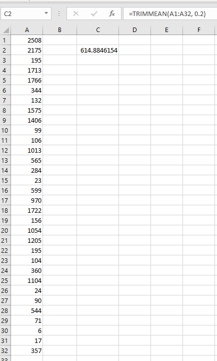

# MySQL TRIMMEAN

Adds a MySQL function to exactly match Excel's `TRIMNMEAN` function. https://support.office.com/en-us/article/trimmean-function-d90c9878-a119-4746-88fa-63d988f511d3

> Returns the mean of the interior of a data set. TRIMMEAN calculates the mean taken by excluding a percentage of data points from the top and bottom tails of a data set. You can use this function when you wish to exclude outlying data from your analysis.

## Usage

```sql
`trimmean` ( `NumberColumn`, double `Percent` [, integer `Decimals` = 4 ] )
```

 - `` `NumberColumn` ``
   - The column of values to trim and average.

 - `` `Percent` ``
   - The fractional number of data points to exclude from the calculation. For example, if percent = 0.2, 4 points are trimmed from a data set of 20 points (20 x 0.2): 2 from the top and 2 from the bottom of the set.

 - `` `Decimals` ``
   - Optionally, the number of decimal places to output. Default is 4.

## Examples

We can quickly build a test table of random numbers by running these queries

```sql
-- build the table for random numbers
create table`rand_numbers`(
    `Number`int not null
);
-- seed the table with the first row
insert into`rand_numbers`(`Number`)values(rand()*3333);
-- run this one 5 times to create 32 rows of random numbers
insert into`rand_numbers`(`Number`)select`Number`*rand()from`rand_numbers`;
insert into`rand_numbers`(`Number`)select`Number`*rand()from`rand_numbers`;
insert into`rand_numbers`(`Number`)select`Number`*rand()from`rand_numbers`;
insert into`rand_numbers`(`Number`)select`Number`*rand()from`rand_numbers`;
insert into`rand_numbers`(`Number`)select`Number`*rand()from`rand_numbers`;
```

Then use this query to see the average and trimmed average, removing 20% of the values from the average (10% from the bottom and 10% from the top) in this example

```sql
select avg(`Number`)`avg`,
`trimmean`(`Number`,.2)`trimmean`
from`rand_numbers`;
```

Which returns this table (your numbers will likely be different since the table was randomly generated)

| avg | trimmean|
| --- | --- |
| 702.5625 | 614.8846 |

We can even verify that this matches exactly by running this query

```sql
select*from`rand_numbers`;
```

and pasting the output into Excel, passing the same exact numbers through Excel's `TRIMMEAN` function

> **Note**: you can use the optional 3rd parameter of the MySQL `TRIMMEAN` function to control the number of decimals, up to 16 decimals



## Dependencies

Debian / Ubuntu

```shell
sudo apt update
sudo apt install libmysqlclient-dev
```

## Installing

You can find your MySQL plugin directory by running this MySQL query

```sql
select @@plugin_dir;
```

then replace `/usr/lib/mysql/plugin` below with your MySQL plugin directory.

```shell
cd ~ # or wherever you store your git projects
git clone https://github.com/StirlingMarketingGroup/mysql-trimmean.git
cd mysql-trimmean
gcc -O3 -I/usr/include/mysql -o trimmean.so -shared trimmean.c -fPIC
sudo cp trimmean.so /usr/lib/mysql/plugin/trimmean.so
```

Enable the function in MySQL by running this MySQL query

```sql
create aggregate function`trimmean`returns real soname'trimmean.so';
```
